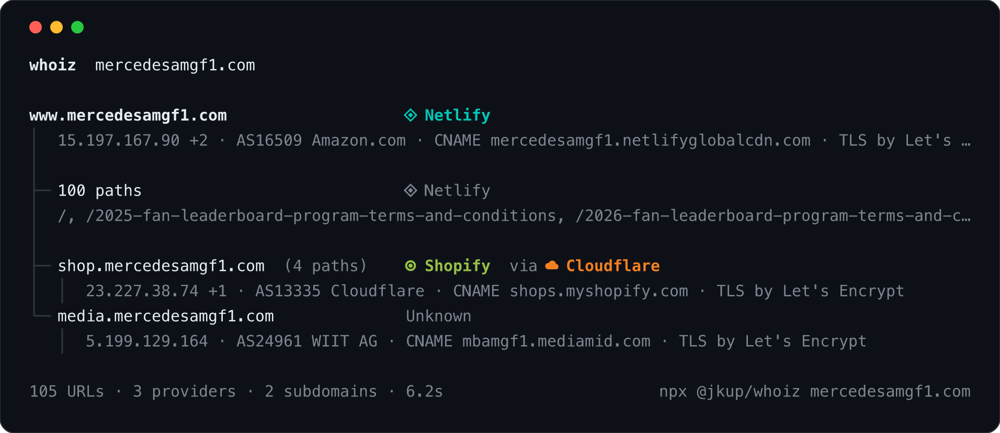

# whoiz

**Who is actually serving this site?**

`whoiz` takes a domain, enumerates its endpoints (sitemap, robots.txt, and a polite shallow crawl), and fingerprints the CDN *and* the hosting provider behind every path and subdomain — then draws you a tree.



`npx @jkup/whoiz mercedesamgf1.com` above: the main site is on Netlify, the shop is Shopify fronted by Cloudflare, and the media host is something whoiz doesn't recognise — so it says so. Paths that are served exactly like the host are folded into one line so the *differences* stand out. Use `--all` to see every path, and `--why` to see the evidence behind each verdict.

### Share it

```
whoiz vercel.com --image vercel.png
```

writes the same tree as a dark terminal-style card, ready to post. Connectors and provider dots are drawn as vector shapes, so it looks the same on every machine regardless of installed fonts.

## Install

```
npx @jkup/whoiz vercel.com    # no install
npm i -g @jkup/whoiz          # or globally, then just `whoiz`
```

Requires Node 20+.

## Usage

```
whoiz <domain or URL> [options]

  --json               machine-readable output with full evidence
  --why                show the evidence behind each verdict
  --all                don't collapse identical siblings or truncate long lists
  -d, --depth <n>      crawl depth (default 2)
  -m, --max <n>        maximum URLs to fetch (default 100, or 30 with --no-crawl)
  -c, --concurrency    parallel requests (default 8)
  -t, --timeout <ms>   per-request timeout (default 8000)
  --no-crawl           only use sitemap, robots.txt and the homepage
  --no-subdomains      ignore other hosts under the same domain
  -i, --image <file>   also write the tree as a shareable PNG (or SVG if the name ends in .svg)
  --scale <n>          PNG pixel density (default 2)
  --ascii              plain ASCII tree characters
  --no-color           disable colours (also honours NO_COLOR)
```

## How it works

Every host gets resolved (CNAME chain, A/AAAA, ASN via Team Cymru DNS, TLS issuer), and every URL gets one GET with redirects tracked. A table of declarative rules scores the evidence per provider on two layers:

- **edge** — who terminates the connection: CNAME targets, published IP ranges, CDN headers like `cf-ray`, `x-amz-cf-pop`, `x-served-by: cache-…`
- **origin** — whose app-layer headers made it through the proxy: `x-vercel-id`, `x-nf-request-id`, `x-github-request-id`, `fly-request-id`, `x-render-origin-server`, …

If only edge signals fire, the CDN is either serving it directly (Pages, Workers, cached) or hiding the origin; whoiz says `no upstream seen` rather than guessing.

Recognised: Cloudflare (+ Pages), Vercel, Netlify, CloudFront, S3, Fastly, GitHub (+ Pages), Fly.io, Render, Google Cloud, Firebase, Azure, Akamai, Heroku, Railway, DigitalOcean, Hetzner, Shopify, Squarespace, Wix, Webflow, WordPress.com, Framer, Discourse, Ghost, HubSpot, Substack, GitBook, ReadMe, Zendesk, Statuspage, Mintlify. Adding one is a couple of lines in [`src/fingerprint/rules.ts`](src/fingerprint/rules.ts).

## Etiquette

whoiz identifies itself (`whoiz/<version> (+repo)`), obeys `robots.txt`, defaults to 8 concurrent requests and 100 URLs, backs off on the first `429`, and never follows links off the domain — other subdomains are only probed at their root plus a few linked pages. It only talks to the target and to DNS; there are no third-party APIs or telemetry.

## Limitations

- Endpoint discovery is best-effort: there is no way to list a site's routes from outside. SPAs and API-only hosts will mostly show their shell.
- A proxy that strips upstream headers makes the origin invisible. `no upstream seen` is an honest "don't know", not "there is nothing behind it".
- No JavaScript rendering.

## Development

```
npm install
npm run dev -- vercel.com      # run from source
npm test                       # vitest
npm run update-ranges          # refresh bundled CDN IP ranges
npm run build                  # dist/cli.js
```

MIT © Jon Kuperman
